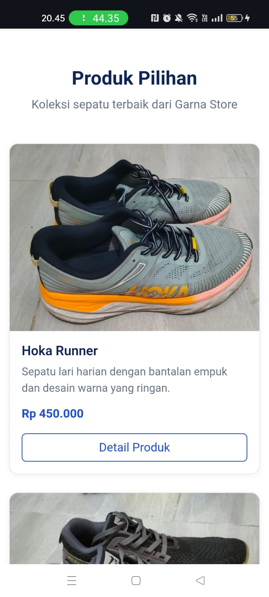
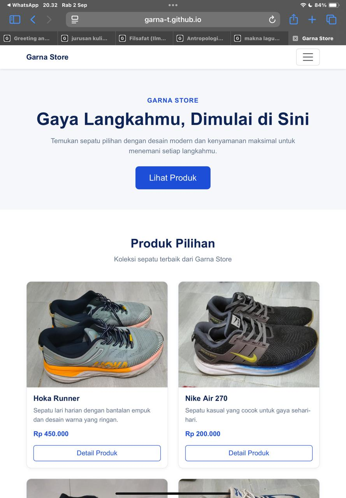

# Garna Store – Katalog Produk Responsif

## Deskripsi

Garna Store merupakan website katalog produk sepatu yang dibuat untuk memenuhi tugas mata kuliah Pemrograman Web. Website ini menampilkan beberapa produk sepatu dengan desain yang sederhana, modern, dan responsif sehingga dapat menyesuaikan tampilan pada berbagai ukuran layar.

Website dibuat menggunakan **HTML, CSS, dan Bootstrap 5** dengan pendekatan **mobile-first**.

## Teknologi yang Digunakan

* HTML5
* CSS3
* Bootstrap 5
* Bootstrap CDN
* JavaScript Bootstrap Bundle

## Fitur Website

* Responsive navbar dengan hamburger menu pada perangkat mobile
* Hero section dengan informasi Garna Store
* Katalog 4 produk sepatu
* Product card yang berisi gambar, nama produk, deskripsi, harga, dan tombol detail
* Detail produk menggunakan modal
* Responsive product grid
* Responsive images
* Responsive typography menggunakan `clamp()`
* Smooth scrolling pada navigasi
* Section kontak
* Footer

## Responsive Layout

Website menggunakan Bootstrap Grid untuk menyesuaikan jumlah kolom berdasarkan ukuran layar.

| Ukuran Layar  | Tampilan Produk |
| ------------- | --------------- |
| Mobile        | 1 kolom         |
| Tablet        | 2 kolom         |
| Laptop        | 3 kolom         |
| Desktop besar | 4 kolom         |

Class Bootstrap yang digunakan:

```html
col-12 col-md-6 col-lg-4 col-xl-3
```

Penggunaan class tersebut membuat layout produk menyesuaikan ukuran layar secara responsif.

## Struktur Project

```text
TugasWeb-Pertemuan3-Katalog/
│
├── index.html
│
├── css/
│   └── style.css
│
└── img/
    ├── produk1.jpg
    ├── produk2.jpg
    ├── produk3.jpg
    └── produk4.jpg
```

## Produk

Website menampilkan empat produk sepatu:

1. Hoka Runner
2. Nike Air 270
3. Street Flex
4. Do-win

Setiap produk memiliki informasi berupa nama produk, deskripsi, harga, dan detail produk.

## Kontak

Instagram: **@ganditrg_**

## Dokumentasi Responsive

### 1. Tampilan Mobile

Ukuran layar: **375 px**



### 2. Tampilan Tablet

Ukuran layar: **768 px**



### 3. Tampilan Desktop

Ukuran layar: **1440 px**


